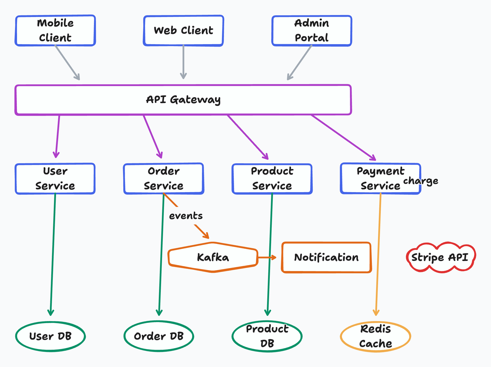

# tldraw-skill — From Text to Whiteboard Diagrams

[中文文档](README_CN.md)

## What it does

- Generates `.tldr` JSON files from natural language descriptions
- Exports diagrams to PNG or SVG using `@kitschpatrol/tldraw-cli`
- **6 diagram type presets**: Architecture, Flowchart, Sequence, ML/Deep Learning, ERD, UML — with preset shape vocabulary and layout conventions
- **Self-check loop** — uses vision to read the exported PNG and auto-fix overlaps, clipped labels, and missing arrows before showing you
- **Iterative review loop** — collect feedback, apply targeted JSON edits, re-export until approved (5-round safety valve)
- **Complexity-scaled layout** — spacing automatically grows with node count to prevent overlaps
- **Auto-update** — pulls the latest skill version once per 24h
- **Custom output directory** — ask for any output path (e.g. `./artifacts/`) and the skill will `mkdir -p` and export there
- Triggers automatically when diagrams would help explain complex systems
- Hand-drawn whiteboard aesthetic by default; switchable to clean fonts

## Multi-Platform Support

Works with all major AI coding agents that support the [Agent Skills](https://agentskills.io) format:

| Platform | Status | Details |
|----------|--------|---------|
| **Claude Code** | ✅ Full support | Native SKILL.md format |
| **Opencode** | ✅ Full support | Native SKILL.md via `skill` tool; also reads `.claude/skills/` paths |
| **OpenClaw / ClawHub** | ✅ Full support | `metadata.openclaw` namespace, dependency gating, ClawHub installer |
| **Hermes Agent** | ✅ Full support | `metadata.hermes` namespace, tags, tool gating |
| **OpenAI Codex** | ✅ Compatible | Place under `.agents/skills/` |
| **SkillsMP** | ✅ Indexed | GitHub topics configured |

## Comparison

### vs Native Agent (no skill)

| Feature | Native agent | This skill |
|---------|-------------|------------|
| Generate `.tldr` JSON | Partial — LLMs often produce schema-invalid records | Yes — schema-correct skeleton + record templates |
| Self-check after export | No | Yes — reads PNG and auto-fixes 6 issue types |
| Iterative review loop | No — must manually re-prompt | Yes — targeted edits, 5-round safety valve |
| Proactive triggers | No — only when explicitly asked | Yes — auto-suggests when 3+ components |
| Layout guidelines | None — varies by run | Complexity-scaled spacing, routing corridors, hub placement |
| Diagram type presets | No | Yes — 6 presets (Architecture, Flowchart, Sequence, ML/DL, ERD, UML) |
| Color palette | Random / inconsistent | 10-color semantic system (blue=services, green=DB, violet=auth...) |
| Arrow distribution rules | Basic | Distribute `normalizedAnchor` across shape perimeter to prevent stacking |
| Index ordering rules | Often wrong (uses `b1`, `c1`) | Strict `a*` format with z-order conventions |
| Multi-platform metadata | No | Yes — OpenClaw, Hermes, SkillsMP namespaces |

### vs Other Diagram Skills

| Feature | tldraw-skill | drawio-skill | mermaid-skill | excalidraw-skill |
|---------|--------------|--------------|---------------|------------------|
| **Aesthetic** | Hand-drawn whiteboard | Clean professional | Auto-layout text | Sketchy informal |
| **Format** | `.tldr` JSON | `.drawio` XML | text DSL | `.excalidraw` JSON |
| **Export formats** | PNG, SVG | PNG, SVG, PDF, JPG | PNG, SVG, PDF | PNG, SVG |
| **Manual layout control** | ✅ x/y coords | ✅ x/y coords | ❌ auto-layout only | ✅ x/y coords |
| **Self-check loop** | ✅ vision-based | ✅ vision-based | partial | partial |
| **Diagram presets** | ✅ 6 types | ✅ 6 types | text-syntax driven | None |
| **Style presets** | ❌ | ✅ user-learnable | ❌ | ❌ |
| **Best for** | Whiteboard sketches, casual explainers, internal docs | Polished business / academic figures | Quick text-to-diagram for docs | Hand-drawn presentations |

## Supported diagram types

- **Architecture**: microservices, cloud, deployment — with tier-based color coding and hub placement
- **Flowcharts**: business processes, decision trees, state machines — with semantic shape types
- **Sequence**: actor-message flows approximated with rectangles + horizontal arrows
- **ML / Deep Learning**: layer-type color coding, tensor shape annotations
- **ERD**: entities as multi-line text rectangles with cardinality on arrows
- **UML Class**: classes as multi-line text rectangles with relationship arrows

## Prerequisites

```bash
# Install tldraw-cli
npm install -g @kitschpatrol/tldraw-cli

# Verify
tldraw --version
```

Requires Node.js (npm). Works identically on macOS, Windows, and Linux — no extra setup required, no browser automation.

## Skill Installation

### Claude Code

```bash
# Global install (available in all projects)
git clone https://github.com/Agents365-ai/tldraw-skill.git ~/.claude/skills/tldraw-skill

# Project-level install
git clone https://github.com/Agents365-ai/tldraw-skill.git .claude/skills/tldraw-skill
```

### Opencode

```bash
# Global install (Opencode-native path)
git clone https://github.com/Agents365-ai/tldraw-skill.git ~/.config/opencode/skills/tldraw-skill

# Project-level install
git clone https://github.com/Agents365-ai/tldraw-skill.git .opencode/skills/tldraw-skill
```

Opencode also reads `~/.claude/skills/` and `.claude/skills/`, so an existing Claude Code install is automatically picked up — no second clone needed.

### OpenClaw

```bash
# Manual install
git clone https://github.com/Agents365-ai/tldraw-skill.git ~/.openclaw/skills/tldraw-skill

# Project-level install
git clone https://github.com/Agents365-ai/tldraw-skill.git skills/tldraw-skill
```

### Hermes Agent

```bash
git clone https://github.com/Agents365-ai/tldraw-skill.git ~/.hermes/skills/design/tldraw-skill
```

### OpenAI Codex

```bash
git clone https://github.com/Agents365-ai/tldraw-skill.git ~/.agents/skills/tldraw-skill
# or project-level
git clone https://github.com/Agents365-ai/tldraw-skill.git .agents/skills/tldraw-skill
```

### Installation paths summary

| Platform | Global path | Project path |
|----------|-------------|--------------|
| Claude Code | `~/.claude/skills/tldraw-skill/` | `.claude/skills/tldraw-skill/` |
| Opencode | `~/.config/opencode/skills/tldraw-skill/` (also reads `~/.claude/skills/`) | `.opencode/skills/tldraw-skill/` |
| OpenClaw | `~/.openclaw/skills/tldraw-skill/` | `skills/tldraw-skill/` |
| Hermes Agent | `~/.hermes/skills/design/tldraw-skill/` | Via `external_dirs` config |
| OpenAI Codex | `~/.agents/skills/tldraw-skill/` | `.agents/skills/tldraw-skill/` |

## Updates

The skill auto-checks for updates once per 24 hours on first use in a conversation (a single `git pull --ff-only`). The check is silent when up to date, offline, or not a git install — it won't block or slow the workflow.

To update manually:

```bash
cd <your-install-path>/tldraw-skill && git pull
```

## Usage

Just describe what you want:

```
Create a microservices e-commerce architecture with API Gateway, auth/user/order/product/payment services,
Kafka message queue, notification service, and separate databases for each service
```

The agent will plan the layout, generate the `.tldr` JSON, export to PNG, self-check, and let you iterate.

## Example

**Prompt:**
> Create a microservices e-commerce architecture with Mobile/Web/Admin clients, API Gateway,
> User/Order/Product/Payment services, Kafka event bus, Notification service,
> and User DB / Order DB / Product DB / Redis Cache / Stripe API

**Output:**



## Files

- `SKILL.md` — **the only required file**. Loaded by all platforms as the skill instructions.
- `README.md` — this file (English, displayed on GitHub homepage)
- `README_CN.md` — Chinese documentation
- `assets/` — example diagrams (safe to delete to save space)

> All example diagrams were generated by Claude with this skill.

## Known Limitations

- **Native UML notation**: tldraw arrowheads are limited (no hollow triangles for inheritance). Use drawio-skill for strict UML/ERD figures intended for academic papers
- **No native containers/swimlanes**: tldraw's grouping model differs from drawio. Use color and spacing for visual grouping instead
- **PDF export not supported**: tldraw-cli supports PNG and SVG only. Convert SVG to PDF post-hoc if needed (e.g. `rsvg-convert`)
- **Self-check requires vision**: The auto-fix step reads exported PNGs using the model's vision capability. Models without vision support skip this step

## License

MIT

## Support

If this skill helps you, consider supporting the author:

<table>
  <tr>
    <td align="center">
      
      <br>
      <b>WeChat Pay</b>
    </td>
    <td align="center">
      
      <br>
      <b>Alipay</b>
    </td>
    <td align="center">
      
      <br>
      <b>Buy Me a Coffee</b>
    </td>
  </tr>
</table>

## Author

**Agents365-ai**

- Bilibili: https://space.bilibili.com/441831884
- GitHub: https://github.com/Agents365-ai
